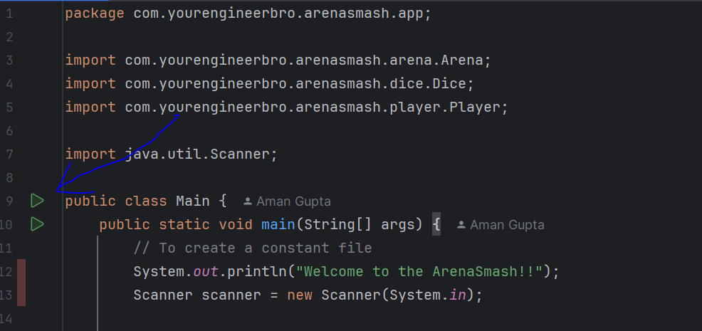
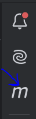
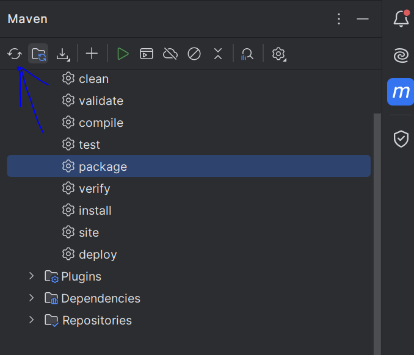
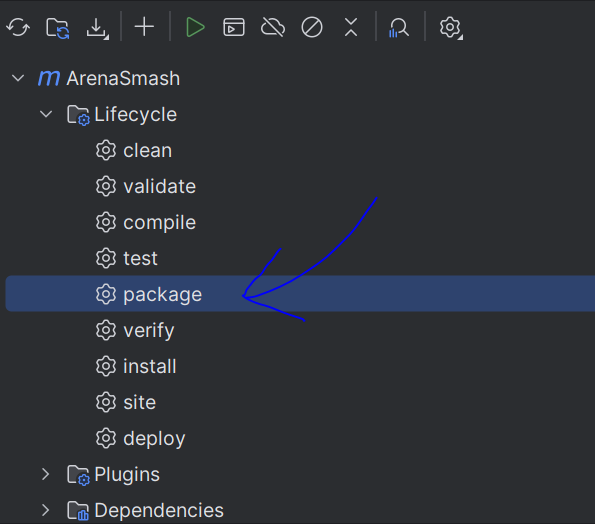

# Welcome to ArenaSmash!

## Rules of the Game:
1) Every Player is defined by a “health” attribute, “strength” attribute and an “attack” attribute - all positive integers.
2) The player dies if his health attribute touches 0. 
3) Any two player can fight a match in the arena. Players attack in turns. Attacking player rolls the attacking dice and the defending player rolls the defending dice. 
4) The “attack”  value multiplied by the outcome of the  attacking dice roll is the damage created by the attacker. The defender “strength” value, multiplied by the outcome of the defending dice is the damage defended by the defender.
5) Whatever damage created by attacker which is in excess of the damage defended by the defender will reduce the “health” of the defender. 
6) Game ends when any players health reaches 0.
7) Player with lower health attacks first at the start of a match. 

## How to play it? 

PreRequisites : Java 11, Maven and IntelliJ installed.
### Way 1:
1) Open your project on IntelliJ.
2) Go to Main class inside src/main/java/com/yourengineerbro/arenasmash/app/Main.java
3) Click the runnable icon to start the game: 


### Way 2:

1) Open the project on IntelliJ.
2) Click on maven icon on topmost right of the intellij.

3) Install the required dependencies clicking:

3) Click on package as shown below:

4) You can otherwise (if not followed steps 2 and 3), can run command

    ``` mvn package```

    to get JAR file created.
5) This will generate JAR into your target folder.
6) Run this command from your project root:
```java -cp .\target\ArenaSmash-1.0-SNAPSHOT.jar com.yourengineerbro.arenasmash.Main```
7) The Game will starts on the terminal.

### Contact
For any further clarification, feel free to reach out to me at guptaaman9981@gmail.com